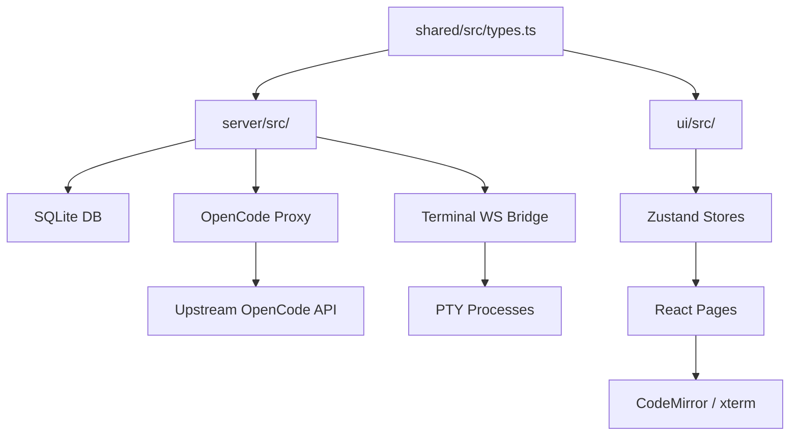

<pilot-implementation-plan>
  <metadata>
    <title>Pilot — Implementation Plan & Critical Architecture Analysis</title>
    <version>1.0.0</version>
    <updated>2026-05-19</updated>
    <status>active</status>
    <package>@MerverliPy/pilot</package>
  </metadata>
</pilot-implementation-plan>

> **OpenCode agent entry point:** This document is the canonical implementation roadmap.  
> Agents: parse `<!-- NEXT-TASK -->` blocks for actionable work items.  
> The lightweight pointer at `.opencode/plans/next-task.json` is the preferred agent entry.

---

## 📋 Repository Dashboard

| Metric | Value |
|---|---|
| **Package** | `@MerverliPy/pilot` — OpenCode PWA |
| **Version** | `0.2.0` |
| **Workspaces** | `server`, `ui`, `shared`, `e2e`, `benchtest` |
| **Language** | TypeScript 5.8 (strict) |
| **Server** | Hono + `@hono/node-server` |
| **Frontend** | React 19 + Vite + Zustand + CodeMirror + xterm |
| **Tests** | Jest (ui), Playwright (e2e) |
| **CI** | GitHub Actions (implied by config) |
| **Auth** | Bearer token (env `PILOT_AUTH_TOKEN`) |
| **DB** | SQLite via `better-sqlite3` |
| **Proxy** | OpenCode API proxy + tunnel + Web Push relay |
| **Workflow** | OpenCode agent suite: 23 agents, 16 skills, 6 plugins |

<p align="right">
  
  
  
  
</p>

---

## ⚡ Critical Repo Analysis

### 🔴 Top Security Risks (from `remediation.md`)

| # | Risk | Severity | File(s) | Impact |
|---|------|----------|---------|--------|
| 1 | **Static file path traversal** | 🔴 Critical | `server/src/index.ts` | Exposes config, `.env`, DB via filesystem root |
| 2 | **Browser secret persistence** | 🔴 Critical | `ui/src/services/auth.ts` | XSS → token exfiltration from localStorage |
| 3 | **SSE auth inconsistency** | 🔴 Critical | `ui/src/services/sse.ts` | EventSource omits auth headers |
| 4 | **Memory embedding tenant leak** | 🔴 Critical | `server/src/memory/` | Cross-tenant data via similarity search |
| 5 | **Debug log leaks** | 🟠 High | Logger middleware | Auth headers, tokens, file contents logged |

### 🟡 Architecture Issues

| Issue | Severity | Details |
|-------|----------|---------|
| Duplicate memory schema | 🟠 High | `ui/src/plugin/memory/db/schema.ts` ≠ `server/src/memory/schema.ts` |
| UI hardcodes relative paths | 🟠 High | `push.ts`, `tunnel.ts`, SSE service bypass `serverUrl` from store |
| Rate limiter map leak | 🟠 High | `Map<string, {...}>` in `server/src/index.ts` — no TTL eviction |
| Dead code | 🟡 Medium | `broadcastPushNotification()` — zero callers |
| Route param validation | 🟡 Medium | `serverId` in memoryRouter — no length/format check |

### 🔵 Code Quality

| Issue | Priority | Notes |
|-------|----------|-------|
| Triplicate JSDoc in memoryRouter | Low | `/timeline` listed 3× |
| Re-export shim in services/types.ts | Low | Remove after confirming zero direct imports |
| Root stale docs | Low | `DESIGN.md`, `MEMORY.md`, `BENCH.md` drift |
| coverage/ debugscreenshots/ in gitignore | Low | Missing from `.gitignore` |

---

<details>
<summary><b>🏗️ Architecture Deep Dive (click to expand)</b></summary>

### Workspace Dependency Graph



### Data Flow

```
Browser → Vite Dev Server/Static → React App → Zustand Stores → Service Clients
                                                                ↓
                                                    Hono Server (auth middleware)
                                                                ↓
                                              ┌───────────────────┼──────────────────┐
                                              ↓                   ↓                  ↓
                                         OpenCode Proxy      Terminal WS       SQLite Memory
                                         (n9routerChat.ts)   (terminal.ts)     (memoryRouter.ts)
```

### Package Scripts

| Command | What it does |
|---------|-------------|
| `npm run dev` | Start server + UI concurrently |
| `npm run build` | Build shared → server → ui sequentially |
| `npm run typecheck` | Typecheck all 4 workspaces |
| `npm run test` | UI Jest tests |
| `npm run test:e2e` | Playwright E2E suite |
| `npm run benchtest` | Workflow benchmark all scenarios |
| `npm run check:opencode` | Typecheck `.opencode/**` config + plugins |

</details>

---

<details>
<summary><b>🗺️ Workspace Maps (click to expand)</b></summary>

### `server/` — Hono Backend (19 source files)

| File | Purpose |
|------|---------|
| `index.ts` | Main app bootstrap, CORS, rate limiter, route mounting |
| `auth.ts` | Bearer token middleware (`requireBearerAuth()`) |
| `terminal.ts` | PTY management + WebSocket bridge |
| `proxy.ts` | OpenCode upstream proxy with header stripping |
| `tunnel.ts` | Cloudflare tunnel manager |
| `push.ts` | Web Push notification relay |
| `git.ts` | Git operation routes |
| `n9routerChat.ts` | N9Router chat completions proxy |
| `sessionTags.ts` | Session tag CRUD |
| `db.ts` | `better-sqlite3` setup |
| `rateLimit.ts` | Request rate limit logic |
| `debugLog.ts` | Structured debug log |
| `cli.ts` | CLI entry point |
| `memory/memoryRouter.ts` | Memory CRUD + search + embeddings |
| `memory/MemoryRepository.ts` | Memory SQLite queries |
| `memory/EmbeddingRepository.ts` | Embedding storage + similarity search |
| `memory/TimelineRepository.ts` | Timeline event store |
| `memory/ProfileRepository.ts` | User profile storage |
| `memory/schema.ts` | Memory domain types |
| `memory/similarity.ts` | Vector similarity functions |
| `memory/memoryDb.ts` | Memory DB schema setup |

### `ui/` — React PWA (7 stores, 12 services, 15 components, 8 pages)

| Layer | Key Files | Role |
|-------|-----------|------|
| Stores | `session.ts`, `server.ts`, `ui.ts`, `connectivity.ts`, `log.ts`, `n9router.ts` | Zustand state management |
| Services | `api.ts`, `auth.ts`, `sse.ts`, `push.ts`, `tunnel.ts`, `n9routerChat.ts`, `memoryApi.ts` | Server communication |
| Pages | `Chat.tsx`, `Sessions.tsx`, `Terminal.tsx`, `Settings.tsx`, `Memory.tsx`, `Diff.tsx`, `Files.tsx`, `SimpleChat.tsx` | Route-level views |
| Components | `ChatMessage.tsx`, `MessageList.tsx`, `PromptInput.tsx`, `CodeMirrorViewer.tsx`, `MarkdownContent.tsx`, `PermissionCard.tsx` | Reusable UI |

### `shared/` — Type Contracts (1 file)

| Export Type | Usage |
|-------------|-------|
| `Session`, `SessionStatus`, `SessionTags` | Chat session shapes |
| `Message`, `Part`, `MessageWithParts` | Message/part hierarchy |
| `Provider`, `Agent`, `Command` | OpenCode entity shapes |
| `FileNode`, `FileContent`, `FileDiff` | File system shapes |
| `ServerEvent` | SSE event union type (14 variants) |
| `ServerConfig`, `N9RouterConfig` | Config shapes |
| `N9RouterModel`, `N9RouterRequest`, `N9RouterUsageStats` | n9router API shapes |
| `ProviderSummary` | Aggregated provider stats |

### `e2e/` — Playwright Suite

| Directory | Content |
|-----------|---------|
| `tests/` | Spec files: chat flow, terminal, tunnel, session |
| `pages/` | Page Object Models |
| `fixtures/` | Test fixtures and mocks |
| `utils/` | Helpers |
| `docs/` | E2E documentation |

### `benchtest/` — Workflow Benchmark

| Component | Purpose |
|-----------|---------|
| `runners/` | Benchmark execution runners |
| `scenarios/` | Workflow routing, context, RTK, fanout scenarios |
| `collector/` | Metric collection |
| `detectors/` | Anomaly detection |
| `reporters/` | HTML/JSON report generation |
| `plugins/` | OpenCode hook instrumentation |

### `.opencode/` — Agent Workflow Layer

| Directory | Count | Purpose |
|-----------|-------|---------|
| `agents/` | 23 | Agent definitions (orchestrator, implementer, verifier, etc.) |
| `skills/` | 16 | Domain-specific playbooks |
| `plugins/` | 6 | Runtime hooks (guardrails, compressor, metrics) |
| `tools/` | 1 | Custom deterministic tools (4 exports) |
| `rules/` | 2 | Canonical policies |
| `commands/` | ~12 | Slash commands |
| `plans/` | 2 | Execution plans (response-quality + next-task) |

</details>

---

## 🎯 Implementation Roadmap

Priority-ranked by effort × impact × security weight.

### Phase 1 — Security Hardening (Critical)

| Task | Files | Est. | Depends On |
|------|-------|------|------------|
| [ ] **1.1** Static file path traversal fix | `server/src/index.ts` | 1h | None |
| [ ] **1.2** Browser secret → httpOnly cookie | `ui/src/services/auth.ts`, auth stores | 2h | None |
| [ ] **1.3** SSE auth middleware audit | SSE route registration + `ui/src/services/sse.ts` | 1h | None |
| [ ] **1.4** Memory embedding tenant scoping | Embedding repository | 2h | None |
| [ ] **1.5** Debug log sanitization | Logger middleware | 1h | None |

### Phase 2 — Architecture Fixes (High)

| Task | Files | Est. | Depends On |
|------|-------|------|------------|
| [ ] **2.1** Duplicate schema → shared/ | `ui/src/plugin/memory/db/schema.ts`, `shared/src/types.ts` | 1h | None |
| [ ] **2.2** Unify UI server-target model | `push.ts`, `tunnel.ts`, SSE, diff services | 1.5h | None |
| [ ] **2.3** Rate limiter TTL cleanup | `server/src/index.ts` | 1h | None |
| [ ] **2.4** Dead code removal | `server/src/push.ts` | 0.5h | Verify callers |
| [ ] **2.5** Route param validation | `memoryRouter.ts`, `git.ts` | 1h | None |

### Phase 3 — Test Coverage (Medium)

| Task | Files | Est. | Depends On |
|------|-------|------|------------|
| [ ] **3.1** Auth rejection E2E tests | `e2e/tests/terminal/`, `tunnel/` | 2h | 1.1-1.5 |
| [ ] **3.2** Security boundary tests | Proxy, static file traversal | 1h | 1.1, 1.3 |
| [ ] **3.3** Memory service unit tests | `server/src/__tests__/` | 1.5h | None |

### Phase 4 — Cleanup (Low)

| Task | Files | Est. |
|------|-------|------|
| [ ] **4.1** Gitignore cleanup | Root `.gitignore` | 0.25h |
| [ ] **4.2** Stale doc archiving | `DESIGN.md`, `MEMORY.md`, `BENCH.md` | 0.5h |
| [ ] **4.3** Triplicate JSDoc dedup | `memoryRouter.ts` | 0.1h |
| [ ] **4.4** Re-export shim removal | `ui/src/services/types.ts` | 0.1h |

---

## 🤖 Agent Next-Task System

<!-- NEXT-TASK: This block is the canonical agent entry point. -->

### Current Priority Task

```json
{
  "id": "TASK-1.1",
  "title": "Static file path traversal fix",
  "status": "pending",
  "priority": "critical",
  "phase": "1-security-hardening",
  "owner": "implementer",
  "depends_on": [],
  "files": ["server/src/index.ts"],
  "risk_labels": ["server-boundary-security", "secrets"],
  "skills": ["pilot-architecture", "server-boundary-security"],
  "verification": ["npm run typecheck -w server", "npm run build -w server"],
  "reviewers": ["security-auditor", "code-reviewer"],
  "description": "Restrict static file serving to known directory. Add path traversal guards. Block filesystem root access."
}
```

**Simplified agent handoff:**

```text
Agent: implementer
Task: Fix static file path traversal in server/src/index.ts
Risk: server-boundary-security, secrets
Skills: pilot-architecture, server-boundary-security
Verify: npm run typecheck -w server && npm run build -w server
Review: security-auditor, code-reviewer
```

### Next-Task Pointer File

Agents should read `.opencode/plans/next-task.json` — a minimal JSON file with the same schema above. This file is optimized for:

- **Token efficiency** — ~400 bytes vs ~2000+ bytes for the full markdown
- **Deterministic parsing** — JSON structure, no regex needed
- **Atomic updates** — One write advances the pointer; agents don't re-scan the plan
- **Agnostic to agent framework** — Works with any agent that reads JSON

---

## 🧪 Verification Gates

### Changed-file-aware verification

| Changed path | Narrowest gate |
|---|---|
| `server/**` | `npm run typecheck -w server` → `npm run build -w server` |
| `ui/**` | `npm run typecheck -w ui` → `npm run test -w ui` |
| `shared/**` | `npm run typecheck -w shared` |
| `e2e/**` | `npm run typecheck -w e2e` → `npm run test:e2e` |
| `.opencode/**` | `npm run check:opencode` |
| `benchtest/**` | `npm run build -w benchtest` → `npm run benchtest:quick` |
| Cross-package | `npm run typecheck` → `npm run build` |

### Risk-based reviewer routing

| Risk label | Reviewer(s) |
|---|---|
| `api-contract` | `api-contract-reviewer` → `typescript-reviewer` |
| `auth-session` | `security-auditor` → `code-reviewer` |
| `terminal-stream` | `terminal-stream-reviewer` → `security-auditor` |
| `proxy-tunnel` | `terminal-stream-reviewer` → `security-auditor` |
| `sqlite-memory` | `sqlite-memory-reviewer` → `security-auditor` |
| `react-render` | `ui-render-reviewer` → `performance-reviewer` |
| `zustand-state` | `ui-render-reviewer` → `performance-reviewer` |
| `bundle-build` | `performance-reviewer` → `typescript-reviewer` |
| `opencode-workflow` | `code-reviewer` → `workflow-profiler` |
| `secrets` | `security-auditor` |

---

## 🔗 Reference Index

| Resource | Path | Use |
|----------|------|-----|
| Coding policy | `.opencode/rules/pilot-core.md` | Edit/verify/security rules |
| Security remediation | `.opencode/rules/remediation.md` | Actionable fix plans |
| Workflow guide | `docs/opencode-workflow-guide.md` | Full agent/command/skill docs |
| Next task pointer | `.opencode/plans/next-task.json` | **Agent entry: parse this first** |
| Architecture skill | `.opencode/skills/pilot-architecture/SKILL.md` | Package boundary navigation |
| Agent configs | `.opencode/agents/*.md` | Per-agent permissions & steps |
| Shared types | `shared/src/types.ts` | All cross-package contracts |
| DB schema | `server/src/memory/schema.ts` | Memory module domain types |

---

<details>
<summary><b>📝 Change Log</b></summary>

| Date | Version | Changes |
|------|---------|---------|
| 2026-05-19 | 1.0.0 | Initial plan: architecture analysis, security risks, 4-phase roadmap, agent next-task system |

</details>
